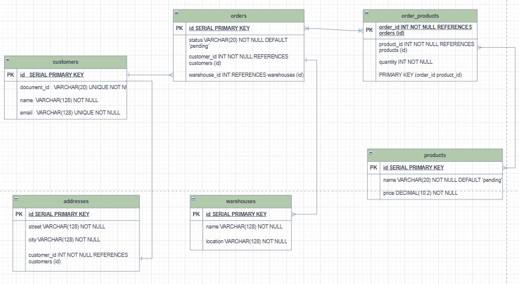

# Backend REST API - FHL

API to manage delivery orders using **Node.js, Express, TypeScript, Sequelize, and PostgreSQL**.

---

##  Requirements

- Node.js >= 18  
- npm >= 9  
- PostgreSQL  

---

##  Installation

1. Install all dependencies:

```bash
npm install
```

2. Create a `.env` file at the root of the project based on `.env.example`:

```
DB_NAME=fhl_db
DB_USER=postgres
DB_PASSWORD=your_password
DB_HOST=localhost
PORT=3000
JWT_SECRET=your_secret
```

###  Prepare the Database

Make sure PostgreSQL is running and create the database:

```sql
CREATE DATABASE fhl_db;
```

Run the seeder to populate initial data:

```bash
npm run seed
```

This will create tables (`users`, `customers`, `addresses`, `products`, `warehouses`, `orders`, `order_products`) and insert sample data.

---

##  Start the Server

For development mode:

```bash
npm run dev

and  seeder

npm run see
```

Server available at:

```
http://localhost:3000
```

Swagger API documentation available at:

```
http://localhost:3000/docs
```

---

## 🧩 Available Scripts

- `npm run dev` — Starts the server in development mode  

- `npm run seed` — Populates the database with initial data

---

## 📦 Main Dependencies

```bash
npm install express cors dotenv sequelize pg jsonwebtoken bcryptjs csv-parser swagger-jsdoc swagger-ui-express
```

DevDependencies (TypeScript and types):

```bash
npm install -D typescript ts-node-dev @types/node @types/express @types/cors @types/jsonwebtoken @types/bcryptjs @types/swagger-jsdoc @types/swagger-ui-express @types/dotenv
```

---

## 📂 Project Structure (Suggested)

```
src/
 ├─ config/
 ├─ models/
 ├─ routes/
 ├─ controllers/
 ├─ seeders/
 ├─ app.ts
 └─ server.ts
```

---

## 🔐 Authentication

Use JWT for authentication (`jsonwebtoken`) and `bcryptjs` for password hashing.

---

## 🗂 Main Tables Overview

- `users` — system administrators/operators  
- `customers` — clients receiving orders  
- `addresses` — addresses related to customers and warehouses  
- `products` — products available for shipment  
- `warehouses` — warehouses managing stock  
- `orders` — delivery orders  
- `order_products` — N:M relationship between orders and products (quantity, price per item)

---

# 🧩 Fragment 2 — Entity–Relationship Diagram


## 📈 Entity–Relationship Diagram (ERD)

The following diagram represents the main entities and their relationships
within the FHL delivery management system.



### **Entities Overview**
- **users** → System administrators and operators  
- **customers** → Clients who receive orders  
- **addresses** → Linked to customers and warehouses  
- **warehouses** → Storage and shipping locations  
- **products** → Items available for delivery  
- **orders** → Delivery orders created by users  
- **order_products** → Junction table (N:M) between orders and products  

> 💡 The `order_products` table defines the many-to-many relationship  
> between `orders` and `products`, including fields such as quantity and unit price.


---

## Author

Santiago
